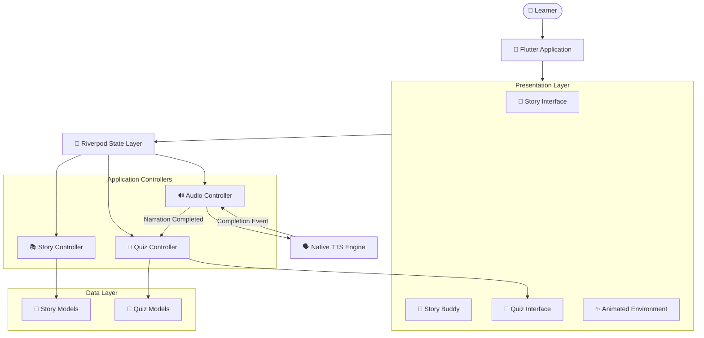
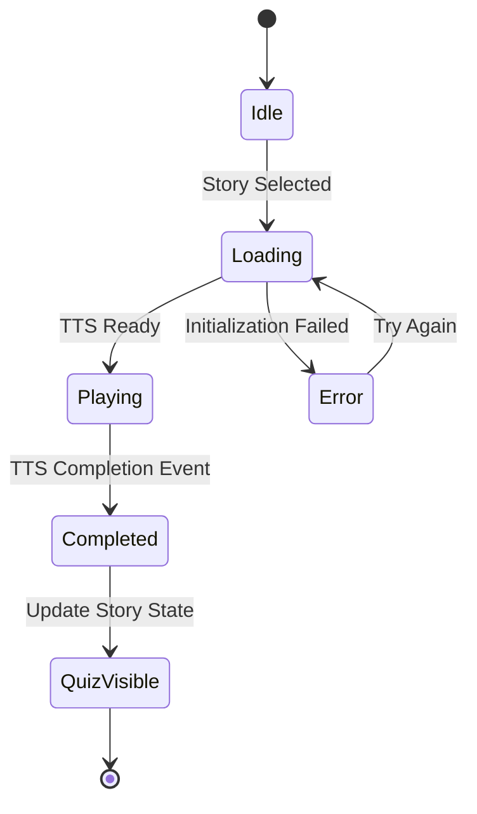
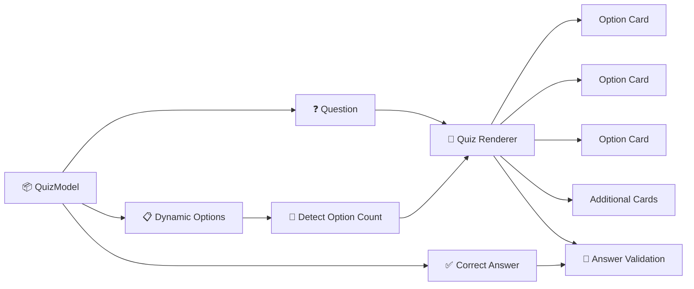
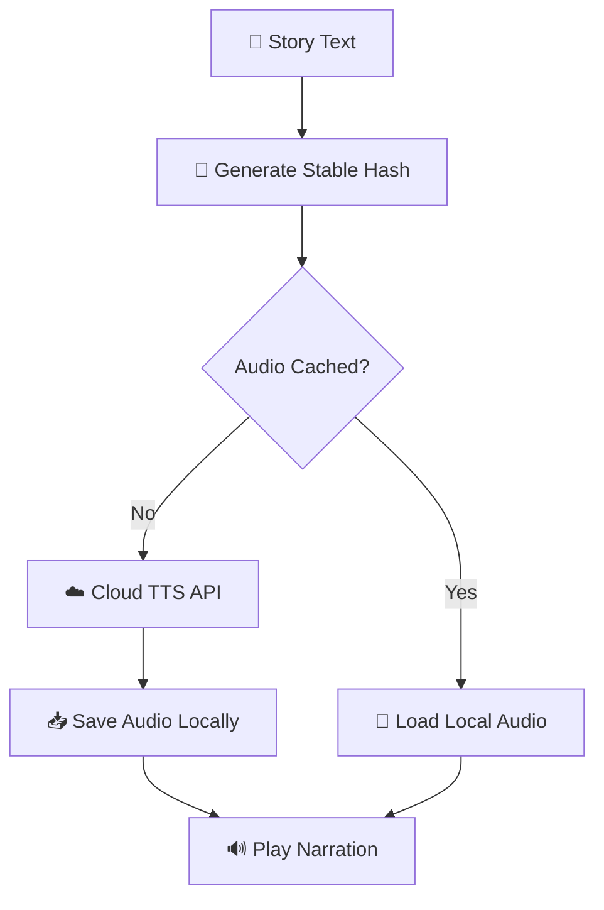

# 📖 Peblo — Interactive Story Buddy & Quiz

> A Flutter-based storytelling and comprehension experience that combines narrated stories, dynamic quizzes, and expressive animated interfaces for young learners.

<p align="center">
  <a href="https://peblo-story-buddy-mayank.netlify.app/">
    
  </a>
</p>

<p align="center">
  
  
  
  
</p>

---

## 📌 Overview

**Peblo** is an interactive story buddy and quiz application designed to create playful storytelling and comprehension experiences for young learners.

The application combines **text-to-speech narration, animated interfaces, dynamic quiz rendering, and event-driven state management** to synchronize storytelling and learning activities.

🌐 **Live Demo:** https://peblo-story-buddy-mayank.netlify.app/

---

## ✨ Core Features

| Feature | Description |
|---|---|
| 📖 **Interactive Stories** | Present engaging story experiences through a playful interface |
| 🔊 **Text-to-Speech Narration** | Narrate story content using platform TTS capabilities |
| 🧠 **Dynamic Quiz Renderer** | Generate quiz layouts from structured question data |
| 🎯 **Story–Quiz Synchronization** | Reveal quizzes after narration completion events |
| 🎨 **Custom Animations** | Programmatically rendered visual elements and animations |
| 📴 **Offline-Friendly Narration** | Use device TTS without requiring remote audio streaming |
| 🛡️ **Failure Recovery** | Handle TTS initialization and playback errors |
| 🌈 **Child-Friendly Interface** | Colorful and expressive learning-focused UI |

---

## 🏛️ Application Architecture



---

## 🔄 Story & Quiz State Flow

Peblo uses an event-driven transition model instead of fixed-duration timers.



The quiz transition is driven by the TTS completion callback rather than an estimated narration timer.

This avoids timing drift when narration speed changes or playback is interrupted.

---

## 🧠 Dynamic Quiz Rendering

Quiz content is separated from presentation logic through structured quiz models.



The renderer can adapt to different option counts without hardcoding a fixed number of answer cards.

---

## 🔊 Audio State Management

```text
TtsAudioState

idle
  │
  ▼
loading
  │
  ├──────────────► error
  │                  │
  │              Try Again
  │                  │
  └◄─────────────────┘
  │
  ▼
playing
  │
  ▼
completed
```

### Why Event-Driven Transitions?

A fixed `Timer` or `Future.delayed` can become inaccurate when:

- Narration speed changes
- Audio playback is interrupted
- The operating system temporarily pauses speech
- Device performance affects initialization

Peblo instead uses the TTS engine's completion event to coordinate the story and quiz lifecycle.

---

## ⚡ Rendering & Performance Approach

Custom visual elements and frequently animated widgets are isolated using Flutter's `RepaintBoundary`.

Examples include:

- Story buddy animations
- Quiz celebration effects
- Audio waveform visuals
- Dynamic environmental animations

This approach reduces unnecessary repaint propagation by separating frequently changing widgets from static interface elements.

> Performance optimization focuses on reducing avoidable redraws and maintaining responsive animation behavior across mobile devices.

---

## 📴 Offline-First Audio Approach

Peblo currently uses device-based text-to-speech through `flutter_tts`.

### Current Flow


This approach avoids remote audio downloads and allows narration capabilities to use supported on-device speech engines.

---

## ☁️ Future Cloud TTS Caching Strategy

If the application migrates to cloud-generated audio, the planned caching workflow is:



A stable content hash can act as a cache key for synthesized narration files.

---

## ⚡ Tech Stack

| Category | Technology |
|---|---|
| **Framework** | Flutter |
| **Language** | Dart |
| **State Management** | Riverpod |
| **Text-to-Speech** | flutter_tts |
| **Graphics** | CustomPainter |
| **Performance Isolation** | RepaintBoundary |
| **Architecture** | Event-Driven State Management |

---

## 📁 Project Structure

```text
lib/
├── models/                  # Story & Quiz Models
├── providers/               # Riverpod State Providers
├── screens/                 # Application Screens
├── services/                # TTS & Application Services
├── widgets/
│   ├── buddy_widget.dart    # Animated Story Buddy
│   ├── quiz_card.dart       # Dynamic Quiz Interface
│   └── story_card.dart      # Story & Narration UI
│
├── data/                    # Story & Quiz Data
└── main.dart                # Application Entry Point
```

---

## 🚀 Getting Started

### Prerequisites

- Flutter SDK
- Dart SDK
- Android Studio or VS Code
- Supported Android, iOS, or Flutter target

### Clone the Repository

```bash
git clone https://github.com/Mayank2014l/peblo_story_buddy.git

cd peblo_story_buddy
```

### Install Dependencies

```bash
flutter pub get
```

### Run the Application

```bash
flutter run
```

---

## 🌐 Live Demo

A web demo of Peblo is deployed on Netlify.

🚀 **Live Demo:** https://peblo-story-buddy-mayank.netlify.app/

---

## 🎯 Engineering Decisions

Key technical decisions explored in this project include:

- Event-driven audio lifecycle management
- TTS completion-based UI transitions
- Data-driven quiz rendering
- Declarative state management with Riverpod
- Custom Flutter graphics
- Repaint isolation for animated widgets
- Offline-friendly narration workflows

---

## 🔮 Future Improvements

- ☁️ Cloud-based neural TTS
- 💾 Persistent audio caching
- 🎭 Additional story buddy characters
- 📚 Expanded story library
- 📊 Learning progress analytics
- 👨‍👩‍👧 Parent dashboard
- 🌍 Multilingual narration
- 🧠 Adaptive quiz difficulty

---

## 📄 License

This project is licensed under the MIT License.

---

<p align="center">
  Built with ❤️ by <b>Mayank Pradhan</b>
</p>
